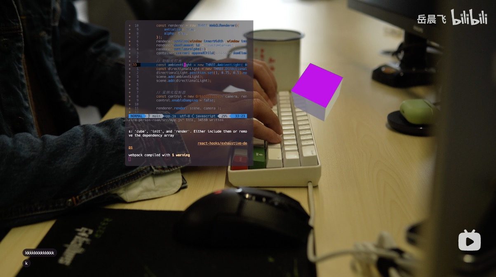

# Terminal Config

## nvim

**setup**
```shell
# 在neovim中执行
:PackerInstall
```

#### Plugin list 
- [wbthomason/packer.nvim](https://github.com/wbthomason/packer.nvim) 插件管理工具 
- [svrana/neosolarized.nvim](https://github.com/svrana/neosolarized.nvim) 主题 colorscheme
- [nvim-lualine/lualine.nvim](https://github.com/nvim-lualine/lualine.nvim) nvim 状态栏插件
- [nvim-tree/nvim-tree.lua](https://github.com/nvim-tree/nvim-tree.lua) 文件树
- [christoomey/vim-tmux-navigator](https://github.com/christoomey/vim-tmux-navigator) 用ctrl-hjkl来定位窗口
- [nvim-treesitter/nvim-treesitter](https://github.com/nvim-treesitter/nvim-treesitter) 语法高亮
- [p00f/nvim-ts-rainbow](https://github.com/p00f/nvim-ts-rainbow) 配合treesitter，不同括号颜色区别
- [williamboman/mason.nvim](https://github.com/williamboman/mason.nvim) Portable package manager
- [williamboman/mason-lspconfig.nvim](https://github.com/williamboman/mason-lspconfig.nvim) bridges mason with the lspconfig plugin
- [neovim/nvim-lspconfig](https://github.com/neovim/nvim-lspconfig) Config for the Nvim LSP client
- [hrsh7th/nvim-cmp](https://github.com/hrsh7th/nvim-cmp) A completion engine
- [hrsh7th/cmp-nvim-lsp](https://github.com/hrsh7th/cmp-nvim-lsp) nvim-cmp source for neovim's built-in language server client
- [L3MON4D3/LuaSnip](https://github.com/L3MON4D3/LuaSnip) LuaSnip
- [saadparwaiz1/cmp_luasnip](saadparwaiz1/cmp_luasnip) luaSnip completion source for nvim-cmp
- [rafamadriz/friendly-snippets](https://github.com/rafamadriz/friendly-snippets) Snippets collection for a set of different programming languages for faster development
- [hrsh7th/cmp-path](https://github.com/hrsh7th/cmp-path) nvim-cmp source for filesystem paths
- [numToStr/Comment.nvim](https://github.com/numToStr/Comment.nvim) 注释，使用gcc或者gc注释
- [windwp/nvim-autopairs](https://github.com/windwp/nvim-autopairs) 自动补全括号
- [akinsho/bufferline.nvim](https://github.com/akinsho/bufferline.nvim) buffer 选项卡
- [lewis6991/gitsigns.nvim](https://github.com/lewis6991/gitsigns.nvim) git 
- [onsails/lspkind-nvim](https://github.com/onsails/lspkind.nvim) tiny plugin adds vscode-like
- [nvim-telescope/telescope.nvim](https://github.com/nvim-telescope/telescope.nvim) 文件检索
- [nvim-telescope/telescope-file-browser.nvim](https://github.com/nvim-telescope/telescope-file-browser.nvim) 文件浏览
- [nvim-lua/plenary.nvim](https://github.com/nvim-lua/plenary.nvim) Plenary是lua模块的集合。集成了常见问题的函数。Telescope内部使用了这个插件
- [windwp/nvim-ts-autotag](https://github.com/windwp/nvim-ts-autotag) autoclose and autorename html tag
- [iamcco/markdown-preview.nvim](https://github.com/iamcco/markdown-preview.nvim) markdown文件预览插件


### 效果链接
1. [Hack Hyper｜终端预览web页面](https://www.bilibili.com/video/BV1384y1u7rm/)

### 需要添加的功能
---
- [ ] React 项目的智能提示功能  
- [ ] 可以智能提示之前写过的代码
- [ ] 软连接dot-config/.config/nvim -> ./config/nvim
